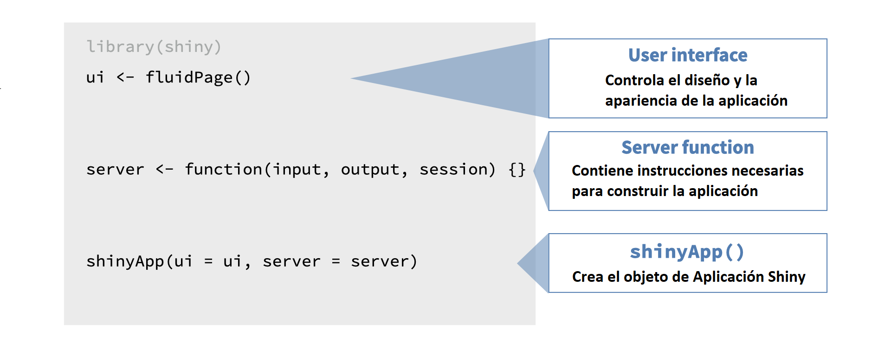

```{r setup, include=FALSE}
library(learnr)
library(shiny)
library(tidyverse)
library(rsconnect)

knitr::opts_chunk$set(
  echo = FALSE, 
  fig.align = "center",
  out.width = "100%"
  )
```

```{css, echo = FALSE}
h2, #TOC ul>li {
  color: #1a3c5d;
  font-weight: bold;
}
```

```{css, echo = FALSE}
h3, #TOC ul>li {
  color: #1a3c5d;
  font-weight: bold;
}
```


## 1.1 Introducción

En este módulo, comenzaremos presentando los conceptos básicos de Shiny.


### Antecedentes
<div style="text-align: justify"> 
Antes de comenzar con Shiny, hablemos de antecedentes ...

Este curso asume que está familiarizado con R como lenguaje de programación.

Además, este curso utiliza paquetes de tidyverse (por ejemplo, [tidyverse](https://tidyverse.org/) (e.g. [**dplyr**](https://dplyr.tidyverse.org/) para la gestión de datos y [**ggplot2**](https://ggplot2.tidyverse.org/) para la visualización de datos). Sus aplicaciones Shiny pueden usar cualquier paquete, pero si desea obtener más información sobre cómo hacer ciencia de datos con tidyverse, consulte [aquí](https://www.tidyverse.org/learn/).
</div>


### 

### Tu primera Aplicación Shiny
<div style="text-align: justify">
A continuación, crearemos una aplicación Shiny simple. Aprenderemos sobre las dos componentes clave de cada aplicación Shiny: la **IU** (abreviatura de interfaz de usuario) que define cómo se ve su aplicación y la función del **SERVER** que define cómo funciona su aplicación. 

Si aún no ha instalado Shiny, instálelo ahora con:
```{r libreria, eval = FALSE, echo = TRUE}
install.packages("shiny")
library("shiny")
```

Hay varias formas de crear una aplicación Shiny. La más simple es crear un nuevo directorio para su aplicación y poner un solo archivo llamado app.R en él. 


**Hay dos formas convenientes para crear una nueva app en RStudio**: 

* Clic en Archivo | Nuevo proyecto, luego seleccione Nuevo directorio y Aplicación web shiny.
* Si ya ha creado el archivo app.R, puede agregar rápidamente el texto estándar de la aplicación escribiendo **shinyapp** y presionando Shift + Tab.


Comencemos creando un nuevo directorio y agregando un archivo app.R que se ve así: [Primera app](https://andres13mh.shinyapps.io/Ejemplo1/)
</div>

### Una Aplicación más estructurada

¡Una aplicación que podrás crear al final del curso! 

```{r, context = "data", cache = TRUE}
load("movies.RData")
```

Aplicación que se ve así: [App Final](https://andres13mh.shinyapps.io/MoviesApp/)


### 

<div style="text-align: justify">
Repasaremos los detalles técnicos de cada componente de dicha aplicación a lo largo del tutorial, pero por ahora echemos una vista de alto nivel.

```{r}
knitr::include_graphics("images/shiny-app-annotated.png")
```

Tenemos:

- Un título para la aplicación,
- una serie de entradas:
   - algunas de estas entradas utilizan menús desplegables para la selección,
   - algunos son deslizadores,
   - algunos permiten la entrada de texto y
   - algunos son botones de acción
- y algunas salidas:
   - una salida del gráfico que el usuario puede actualizar de forma interactiva,
   - una salida de texto que se actualiza junto con ella, y
   - una salida de tabla de datos que también se actualiza junto con estos.

Por mucho que parezca que están sucediendo muchas cosas en esta aplicación, la aplicación apenas es una muestra de lo que puede construir con Shiny.
</div>

### Consejos

<div style="text-align: justify">
Además, repasemos tres consejos muy importantes para aprender a desarrollar aplicaciones Shiny:

1. Siempre **ejecute todo el script** que contenga el código R, no solo hasta el punto en el que esté desarrollando el código. Para la mayoría de los ejercicios de este tutorial, se le pedirá que modifique o actualice el código Shiny existente y, aunque puede estar alterando una pequeña parte del código, aún debe ejecutar el código completo de la aplicación para crear la aplicación.

2. A veces, la mejor manera de solucionar problemas es **ejecutar la aplicación y revisar el error**. El mensaje de error no solo puede ser informativo, sino que buscarlo en Google puede llevarlo rápidamente a una solución.

3. **¡Cuidado con las comas!** Esto significará más a medida que comiences a aprender Shiny, pero ten en cuenta que un error de Shiny a menudo puede ser causado por una coma faltante. Afortunadamente, RStudio IDE lo alertará sobre la mayoría de estos errores de sintaxis de coma o similares, como el que se muestra a continuación.

```{r, out.width = "30%"}
knitr::include_graphics("images/missing-comma-ide.png")
```
</div>

### Estructura de una aplicación Shiny

<div style="text-align: justify">
El script app.R tiene tres componentes:

```{r, out.width = "80%"}

```

* La interfaz de usuario (UI)
* La función de servidor (SERVER)
* Una llamada a la función shinyApp.

El objeto ui controla el diseño y la apariencia de la aplicación, mientras que la función server contiene las instrucciones que el computador necesita para construir la aplicación. Finalmente, la función shinyApp crea los objetos de la aplicación Shiny desde el par ui/server.
</div>

### Datos

<div style="text-align: justify">
Para crear la aplicación de navegador de películas.

Usaremos datos del conjunto de datos de películas, que combina datos de dos sitios web: Internet Movie Database, comúnmente conocida como IMDB, y Rotten Tomatoes. Las observaciones son una muestra aleatoria de 651 películas estrenadas en Estados Unidos entre 1970 y 2014.

No olvidar cargar las librerías y todas las dependencias necesarias para la aplicación antes de la interfaz de usuario (UI) y la función del servidor (SERVER)

```{r, out.width = "80%"}
knitr::include_graphics("images/revisit.png")
```
</div>

### Práctica1: Responde la Pregunta

```{r mc-1}
question("¿Cuál no es generalmente parte de la arquitectura de la aplicación Shiny?",
  answer("Una función que instala un paquete R",
    correct = TRUE,
    message = "No desea reinstalar el paquete cada vez que ejecuta su aplicación, por lo que debe hacerlo una vez en su consola en lugar de dentro de su aplicación Shiny."
  ),
  answer("Interfaz de usuario"),
  answer("Función del servidor"),
  answer("Una función que crea objetos de aplicación Shiny"),
  allow_retry = TRUE,
  random_answer_order = TRUE
)
```

### Práctica1: Tu primera Aplicación Shiny

<div style="text-align: justify">
A continuación se puede ver el código completo para reproducir la aplicación que presentamos en la sección anterior. Ahora puedes interactuar con la aplicación tú mismo y realizar pequeños ajustes en ella.

Ubique las líneas de código relevantes en app.R la construcción del widget selector para el eje Y. Esto está en una función **selectInput()** que comienza en la línea 17, debajo del comentario **# Seleccionar variable para el eje y**. Tenga en cuenta que esta función toma cuatro argumentos: **inputId, label, choices, y selected**. Cambie el argumento **selected** a **imdb_rating**, guarde los cambios y vuelva a ejecutar la aplicación haciendo clic en Ejecutar aplicación.
</div>

```{r ex-1-1-selector, eval = FALSE, echo = TRUE}
# Cargar paquetes ----------------------------------------------------------------
library(shiny)
library(ggplot2)

# Cargar datos -------------------------------------------------------------------
load("movies.RData")

# Definir interfaz de usuario ----------------------------------------------------
ui <- fluidPage(

  sidebarLayout(

    # Inputs: Seleccionar variables para trazar
    sidebarPanel(

      # Seleccionar variable para el eje y
      selectInput(
        inputId = "y",
        label = "Y-axis:",
        choices = c("imdb_rating", "imdb_num_votes", "critics_score", "audience_score", "runtime"),
        selected = "audience_score"
      ),
      # Seleccionar variable para el eje x
      selectInput(
        inputId = "x",
        label = "X-axis:",
        choices = c("imdb_rating", "imdb_num_votes", "critics_score", "audience_score", "runtime"),
        selected = "critics_score"
      )
    ),

    # Output: Mostrar diagrama de dispersión
    mainPanel(
      plotOutput(outputId = "scatterplot")
    )
  )
)

# Definir el Server ----------------------------------------------------------------
server <- function(input, output, session) {
  output$scatterplot <- renderPlot({
    ggplot(data = movies, aes_string(x = input$x, y = input$y)) +
      geom_point()
  })
}

# Crea un objeto de aplicación Shiny ----------------------------------------------------
shinyApp(ui = ui, server = server)
```


## 1.2 Interfaz de usuario (UI)

### 

En esta sección, crearemos la interfaz de usuario de una aplicación.

Sin embargo, antes revisemos la estructura visual básica de una App Shiny.


```{r}
knitr::include_graphics("images/app-selectinput-scatterplot.png")
```

- La interfaz de usuario (UI), define y presenta las entradas de su aplicación donde se pueden hacer las selecciones. También presenta las salidas.

- La función de servidor (SERVER), calcula las salidas y realiza cualquier otro cálculo necesario para las salidas.

Veamos el siguiente ejemplo:

```{r}
knitr::include_graphics("images/ui-to-scatterplot.png")
```

Si la aplicación presenta un gráfico, el código para construir ese gráfico vive en la función del servidor. Pero la configuración de las entradas definidas por el usuario para el gráfico, así como la información sobre dónde debe aparecer físicamente en la aplicación, se definen en la interfaz de usuario. 

###

A continuación se muestra laa aplicación con la que trabajaremos en esta sección y el código que crea la interfaz de usuario de esa aplicación.

```{r}
knitr::include_graphics("images/app-selectinput-scatterplot.png")
```

```{r ex-1-1-selector1, eval = FALSE, echo = TRUE}
# Definir interfaz de usuario -------------------------------------------------
ui <- fluidPage(
  # Diseño de barra lateral con definiciones de entrada y salida --------------
  sidebarLayout(
    # Inputs: Seleccionar variables para trazar
    sidebarPanel(
      # Seleccionar variable para el eje y
      selectInput(
        inputId = "y",
        label = "Y-axis:",
        choices = c("imdb_rating", "imdb_num_votes", "critics_score", 
                    "audience_score", "runtime"),
        selected = "audience_score"
      ),
      # Seleccionar variable para el eje x
      selectInput(
        inputId = "x",
        label = "X-axis:",
        choices = c("imdb_rating", "imdb_num_votes", "critics_score", 
                    "audience_score", "runtime"),
        selected = "critics_score"
      )
    ),

    # Output: Mostrar diagrama de dispersión
    mainPanel(
      plotOutput(outputId = "scatterplot")
    )
  )
)
```


### Estructura visual básica de la página - `fluidPage()`

`fluidPage()` es una función de diseño que configura la estructura visual básica de la página.


```{r}
knitr::include_graphics("images/fluidPage.png")
```

